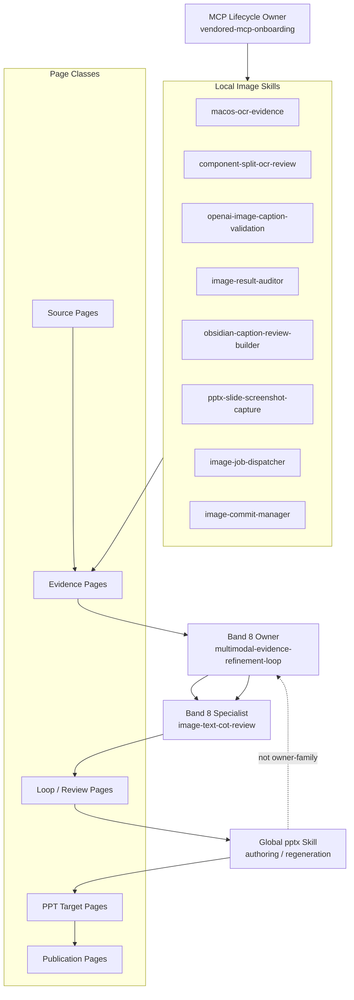

# Image Skill Family To PPT Page Link Mapping Design

## Purpose

Freeze a step-by-step mapping design that connects:

- canonical family taxonomy from `Skills-Create-Project`
- local `my-image-parser` image skills
- PPT page authoring and regeneration surfaces

This design treats PPT as an authoring and consumer surface, **not** as an owner-family skill.

## Canonical Reading

The existing canonical taxonomy already defines the owner-family structure.

### Family / Owner Canon

- owner band taxonomy:
  - [`owner-task-bands-at2026-04-02.md`](<CLAUDE_SKILLS_ROOT>/Skills-Create-Project/skill-creation-process/references/owner-task-bands-at2026-04-02.md)
- family closure rule:
  - [`family-closure-audit-checklist-at2026-04-02.md`](<CLAUDE_SKILLS_ROOT>/Skills-Create-Project/skill-creation-process/references/family-closure-audit-checklist-at2026-04-02.md)
- fact ownership rule:
  - [`fact-owner-map.md`](<CLAUDE_SKILLS_ROOT>/Skills-Create-Project/_shared/fact-owner-map.md)

### Multimodal Family Canon

- Band 8 owner:
  - [`multimodal-evidence-refinement-loop`](<CLAUDE_SKILLS_ROOT>/Skills-Create-Project/multimodal-evidence-refinement-loop/SKILL.md)
- Band 8 specialist:
  - [`image-text-cot-review`](<CLAUDE_SKILLS_ROOT>/Skills-Create-Project/image-text-cot-review/SKILL.md)

### MCP Lifecycle Owner Canon

- owner-family entrypoint:
  - [`vendored-mcp-onboarding`](../../../../skills/vendored-mcp-onboarding/SKILL.md)
- owner/consumer map:
  - [`tool-owner-family-map.md`](../../../../skills/vendored-mcp-onboarding/references/tool-owner-family-map.md)

### PPT Authoring Surface

- global authoring skill:
  - [`pptx`](<CODEX_HOME>/skills/pptx/SKILL.md)

## Core Rule

PPT is **not** a new owner-family surface in this program.

Instead:

- `multimodal-evidence-refinement-loop` owns iterative image understanding
- `image-text-cot-review` owns normalization into machine-truth and human-facing review surfaces
- local image skills remain workflow specialists and evidence producers
- `vendored-mcp-onboarding` owns MCP lifecycle integrity
- global `pptx` is the authoring and regeneration surface that consumes approved understanding

## Step-By-Step Mapping Design

### Step 1. Freeze the routing vocabulary first

Use the existing canonical labels. Do not invent a new family name for `my-image-parser`.

- owner-family term:
  - `multimodal-evidence-refinement-loop`
- specialist term:
  - `image-text-cot-review`
- MCP lifecycle owner:
  - `vendored-mcp-onboarding`
- PPT authoring surface:
  - `pptx`

Reason:

- routing language must match the canonical family taxonomy before page or skill linking starts

### Step 2. Classify local image skills by role, not by file location

Local image skills should be grouped into four functional layers.

#### A. Evidence acquisition

- [`macos-ocr-evidence`](../../../../skills/macos-ocr-evidence/SKILL.md)
- [`component-split-ocr-review`](../../../../skills/component-split-ocr-review/SKILL.md)
- [`pptx-slide-screenshot-capture`](../../../../skills/pptx-slide-screenshot-capture/SKILL.md)

#### B. Caption / interpretation execution

- [`openai-image-caption-validation`](../../../../skills/openai-image-caption-validation/SKILL.md)
- [`image-worker`](../../../../skills/image-worker/SKILL.md)

#### C. Review / normalization / audit

- [`image-result-auditor`](../../../../skills/image-result-auditor/SKILL.md)
- [`obsidian-caption-review-builder`](../../../../skills/obsidian-caption-review-builder/SKILL.md)
- [`parser-sidecar-to-canonical-schema-promotion`](../../../../skills/parser-sidecar-to-canonical-schema-promotion/SKILL.md)

#### D. Dispatch / commit / post-approval

- [`image-job-dispatcher`](../../../../skills/image-job-dispatcher/SKILL.md)
- [`image-commit-manager`](../../../../skills/image-commit-manager/SKILL.md)

Rule:

- these are local workflow specialists
- they are not promoted to owner-family simply because they touch images

### Step 3. Define the page taxonomy

The mapping must link **page classes**, not only skill names.

Use five page classes.

#### 1. Source pages

- source PPT pages or extracted slide/media records
- examples:
  - `control/project_domain/resources/pptx_jobs/<job>/manifest.json`
  - source slide numbers
  - extracted media file paths

#### 2. Evidence pages

- OCR reports
- component split reports
- caption ledgers
- comparison bundles
- screenshot datasets

#### 3. Loop-state / review pages

- machine-truth manifests
- human-facing review markdown
- pending markers
- decision capture rows

#### 4. PPT target pages

- target portfolio slides
- regeneration target slides
- slide specs or role-matrix rows

#### 5. Publication pages

- review index
- QA report
- public symlink surface

### Step 4. Define the canonical link direction

Use this link order:

`source page -> evidence page -> loop/review page -> PPT target page -> publication page`

This is the minimum safe chain.

Do not skip directly from source page to PPT page.

Reason:

- if the evidence and loop state are not represented, the PPT page has no traceable justification

### Step 5. Freeze the page-link fields

Each PPT target page should be represented by one machine-readable row or page-spec block with these fields:

- `target_slide_no`
- `target_slide_title`
- `presentation_role`
- `source_job`
- `source_slide_numbers`
- `source_image_files`
- `evidence_pages`
- `loop_state_pages`
- `skills_used`
- `owner_family_ref`
- `mcp_owner_ref`
- `approved_caption_ref`
- `approved_alt_text_ref`
- `form_preservation_notes`

Rule:

- `skills_used` is descriptive
- `owner_family_ref` and `mcp_owner_ref` are routing anchors
- factual values should still come from the canonical machine-truth artifacts, not from prose-only pages

### Step 6. Link PPT pages back to image skills explicitly

PPT target pages should declare which image skills contributed evidence.

Example mapping:

- `architecture/system slide`
  - likely links:
    - `pptx-slide-screenshot-capture`
    - `macos-ocr-evidence`
    - `openai-image-caption-validation`
    - `image-result-auditor`
- `table-heavy evidence slide`
  - likely links:
    - `macos-ocr-evidence`
    - `component-split-ocr-review`
    - `parser-sidecar-to-canonical-schema-promotion`
    - `image-result-auditor`
- `UI/workflow slide`
  - likely links:
    - `macos-ocr-evidence`
    - `openai-image-caption-validation`
    - `obsidian-caption-review-builder`
    - `image-text-cot-review`

Rule:

- the PPT page is not the owner
- it is the downstream consumer page that cites which image-side specialists shaped its approved interpretation

### Step 7. Separate family ownership from page ownership

Do not confuse these two.

- family ownership:
  - who owns routing, closure, and semantic loop structure
- page ownership:
  - which page/spec row records the final consumption shape for one PPT slide

Canonical split:

- family owner:
  - `multimodal-evidence-refinement-loop`
- specialist normalizer:
  - `image-text-cot-review`
- page consumer:
  - `pptx`

### Step 8. Add a page-link matrix before any new skill is created

Before opening a new skill-creation slice, create one matrix that maps:

- local image skill
- produced page class
- consumed page class
- upstream owner
- downstream PPT use

This matrix should answer:

1. which skill produces the evidence page?
2. which family owns the refinement loop?
3. which page becomes the machine-truth bridge?
4. which PPT page consumes the approved result?

### Step 9. Only then decide whether a new local owner skill is needed

Default answer:

- probably no

Reason:

- Band 8 owner already exists canonically
- local image skills are already specialists
- the first missing artifact is more likely a `page-link matrix` or `handoff contract`, not a new owner skill

Only reopen owner creation if repeated evidence shows:

- the existing Band 8 owner cannot express the PPT page-consumption model
- the local image skill family has stable responsibilities not covered by the current owner/specialist split

## Recommended First Artifact

Create a `PPT page link matrix` as the first concrete mapping artifact.

Suggested output path:

- `control/project_domain/resources/manifests/ppt_page_link_matrix_v0_1.json`

Suggested row example:

```json
{
  "target_slide_no": 4,
  "target_slide_title": "Implementation Depth",
  "presentation_role": "problem_and_code_proof",
  "source_job": "02_1",
  "source_slide_numbers": [6],
  "source_image_files": ["image22.png"],
  "evidence_pages": [
    "macos_ocr_evidence",
    "openai_caption_ledger"
  ],
  "loop_state_pages": [
    "machine_truth_manifest",
    "review_surface_markdown"
  ],
  "skills_used": [
    "macos-ocr-evidence",
    "openai-image-caption-validation",
    "image-result-auditor"
  ],
  "owner_family_ref": "multimodal-evidence-refinement-loop",
  "mcp_owner_ref": "vendored-mcp-onboarding",
  "approved_caption_ref": "phase2_caption_review_decision_seed",
  "approved_alt_text_ref": "phase2_caption_review_decision_seed",
  "form_preservation_notes": "problem statement and code layout must both remain visible"
}
```

## Visual Architecture



## One-Line Summary

Map the existing Band 8 multimodal owner and specialist onto the local image-skill ecosystem first, then create explicit `source -> evidence -> loop/review -> PPT target -> publication` page links; treat `pptx` as the downstream authoring surface, not as a new owner skill.
