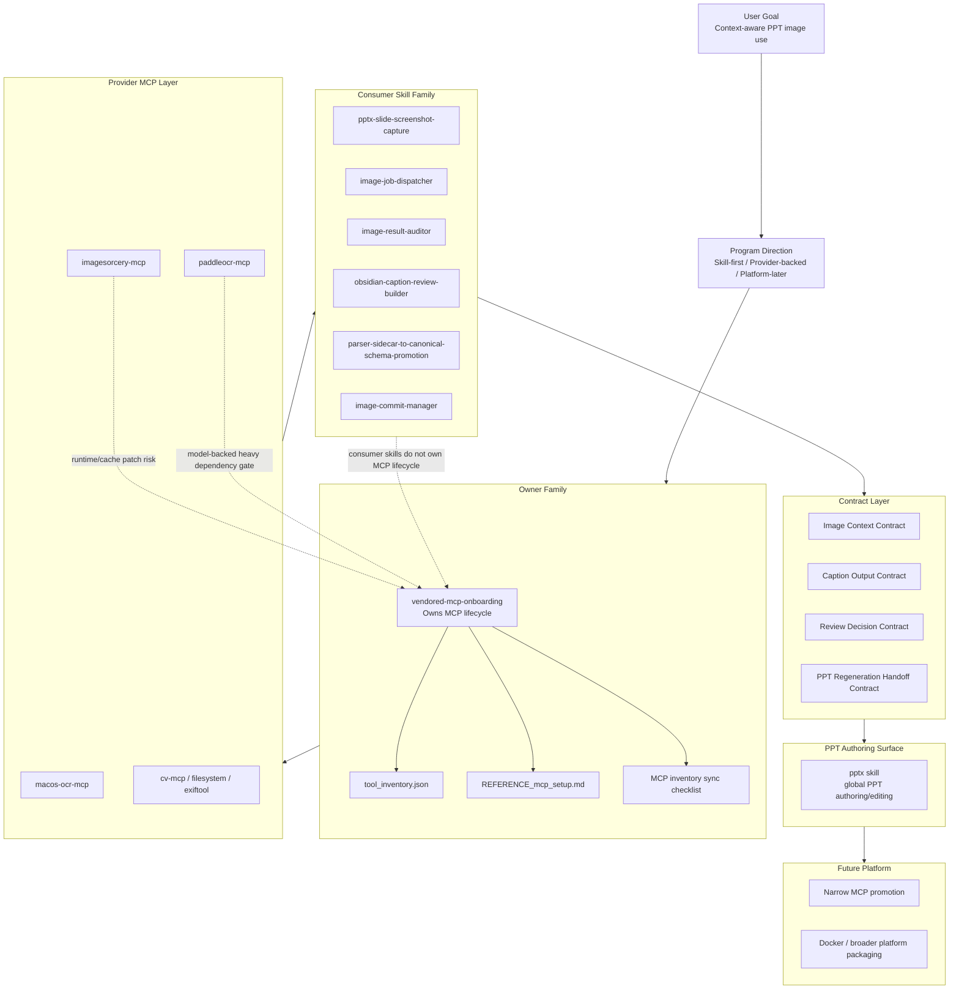

# Skill Owner-Family / MCP Dependency / PPT Platform Architecture

## Purpose

Summarize the owner-skill and family-skill concept on this Mac, identify the MCP dependency gate that must be checked before platform growth, and visualize the recommended `skill-first` evolution path for PPT-centered image understanding.

## Confirmed Concept On This Mac

This Mac already uses an `owner-family` pattern.

The clearest confirmed example is:

- owner-family entrypoint:
  - [`skills/vendored-mcp-onboarding/SKILL.md`](../../../../skills/vendored-mcp-onboarding/SKILL.md)
- owner-vs-consumer map:
  - [`skills/vendored-mcp-onboarding/references/tool-owner-family-map.md`](../../../../skills/vendored-mcp-onboarding/references/tool-owner-family-map.md)

This means:

- one `owner-family` skill owns lifecycle integrity for a bounded surface
- other skills in the same area remain `consumer specialists`
- consumer specialists may depend on MCPs, but they do not own launcher, config, inventory, or activation state

## Current Practical Reading

### Owner layer

- `vendored-mcp-onboarding`
  - owns vendored third-party MCP lifecycle integrity
  - owns `vendor -> launcher -> config -> inventory -> smoke`
  - owns writes to:
    - `control/project_agent_ops/registry/tools/tool_inventory.json`
    - `control/project_agent_ops/resources/tools_inventory/REFERENCE_mcp_setup.md`

### Consumer layer

Current image/PPT workflow specialists are closer to consumer-family skills:

- `image-job-dispatcher`
- `image-result-auditor`
- `obsidian-caption-review-builder`
- `parser-sidecar-to-canonical-schema-promotion`
- `pptx-slide-screenshot-capture`
- `image-commit-manager`

These should orchestrate workflow slices, not absorb MCP lifecycle ownership.

## PPT Skill Reality

Two relevant PPT skills were confirmed.

### Global PPT authoring skill

- global `pptx` skill under `<CODEX_HOME>/skills/pptx/SKILL.md`

This is the strongest current PPT authoring/editing skill on this Mac.

It covers:

- reading `.pptx`
- editing existing `.pptx`
- creating new presentations
- QA and render-to-image verification

### Local PPT validation skill

- [`skills/pptx-slide-screenshot-capture/SKILL.md`](../../../../skills/pptx-slide-screenshot-capture/SKILL.md)

This is not a PPT authoring skill.

It is a local cross-validation skill for:

- `PPTX -> viewer surface -> screenshot -> caption validation`

## MCP Dependency Gate That Must Be Preserved

Before any platform expansion, MCP dependency integrity must be checked through the owner-family gate.

Canonical checklist:

- [`skills/vendored-mcp-onboarding/checklists/mcp_inventory_sync_checklist.md`](../../../../skills/vendored-mcp-onboarding/checklists/mcp_inventory_sync_checklist.md)

The required dependency surfaces are:

1. vendor runtime isolation
2. launcher correctness
3. Codex / VS Code config registration
4. inventory truth
5. setup reference truth
6. smoke evidence
7. adjacent skill-doc sync
8. system-skill coverage when a workflow depends on global skills

## Current MCP Risk Notes

Based on current inventory and setup references:

- `macos-ocr-mcp`
  - local OCR provider
  - lighter runtime risk than model-heavy table or vision stacks
- `imagesorcery-mcp`
  - local object detection / segmentation / OCR / image editing
  - has heavier runtime notes such as vendored venv patching and YOLO cache redirection
- `paddleocr-mcp`
  - local CPU PP-StructureV3 table parsing path
  - explicitly model-backed and requires heavier smoke confidence than a plain boot check

Relevant sources:

- [`control/project_agent_ops/registry/tools/tool_inventory.json`](../../registry/tools/tool_inventory.json)
- [`control/project_agent_ops/resources/tools_inventory/REFERENCE_mcp_setup.md`](../tools_inventory/REFERENCE_mcp_setup.md)

## Recommended Ownership Model For The Next Program

### Owner family remains separate

Keep MCP lifecycle ownership in the owner-family layer:

- `vendored-mcp-onboarding`

### Workflow family stays skill-first

Use consumer-family skills to orchestrate the next program:

- `pptx-slide-screenshot-capture`
- `image-job-dispatcher`
- `image-result-auditor`
- `obsidian-caption-review-builder`
- `parser-sidecar-to-canonical-schema-promotion`
- later a dedicated PPT regeneration orchestration skill if repetition justifies it

### PPT authoring should reuse the existing global PPT skill

For actual PPT creation or regeneration, the best current authoring surface is:

- `pptx`

That means the local workspace should not immediately create a second overlapping PPT creation skill unless the workflow proves a stable local specialization.

## Visual Architecture

## Design Rule

Do not collapse these layers too early.

Specifically:

- do not let workflow skills own MCP launcher/config/inventory state
- do not force model-backed providers into one mandatory monolithic runtime too early
- do not build a workspace-local PPT authoring skill that duplicates the existing `pptx` skill without stable repeated evidence

## Best Near-Term Move

1. extend the existing local consumer skills
2. freeze the contract layer
3. use `vendored-mcp-onboarding` as the lifecycle gate for any MCP drift
4. reuse `pptx` as the PPT regeneration or authoring surface
5. only later decide whether one narrow local MCP or Docker packaging is justified

## One-Line Summary

This Mac already supports an `owner-family + consumer-family` model; the correct next architecture is to keep MCP ownership separate, extend workflow skills first, reuse the existing `pptx` authoring skill, and visualize the whole path as `owner family -> provider MCPs -> consumer skills -> contracts -> PPT authoring -> later platform packaging`.
