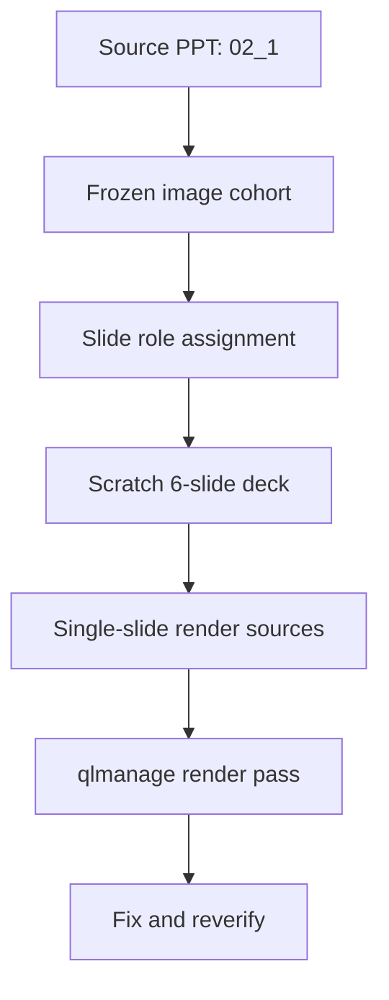

# PLAN_lean_ppt_image_character_portfolio_slice-at2026-04-11

## Purpose

Produce a lean PPT portfolio draft that actively uses the characteristics of images already embedded in a source PPT.

This slice is intentionally smaller than the broader platform direction.

## Lean Goal

Build one reviewable portfolio deck where images do real narrative work.

The images should not be treated as decoration only.

Each selected image should contribute one or more of:

- product feel
- personal credibility
- technical depth
- system thinking
- execution evidence

## Frozen Scope

### Primary source

- `control/project_domain/resources/pptx_jobs/02_1`

### Authoring surface

- global `pptx` skill at `<CODEX_HOME>/skills/pptx/SKILL.md`

### Copy clarity support

- `<CLAUDE_SKILLS_ROOT>/semantic-clarity-enhanced/SKILL.md`

### Supporting local workflow surfaces

- existing extracted image assets under `pptx_jobs/02_1/media`
- existing caption and review evidence only as support
- repo-local `.venv` with `python-pptx`, `PIL`, and `markitdown`
- Quick Look thumbnail rendering via `qlmanage -t`

### Explicitly out of scope

- new MCP creation
- Docker packaging
- full provider matrix implementation
- whole-corpus caption regeneration
- full downstream retrieval or mapping execution
- MCP re-onboarding, launcher/config/inventory/setup-doc changes
- provider smoke, provider reconfiguration, or provider comparison

## Why `02_1`

`02_1` is the best lean source because it already contains a portfolio-friendly mix:

- personal/profile imagery
- product and UI screenshots
- system architecture visuals
- code/problem-solving artifacts
- portfolio summary tables

By contrast, `01_full_presentation_2026-03-17` is stronger as an evaluation/evidence deck than as a first portfolio narrative source.

## Design Rule

The deck should be `image-character-driven`, not `caption-driven`.

That means:

- first choose image role and portfolio role
- then write supporting text
- do not start from long body text and paste images afterward

## Frozen Representative Assets

Use this frozen cohort for v1:

- `image27.png`
  - architecture / retrieval system explanation
- `image4.png`
  - product configuration UI
- `image37.png`
  - generated narrative result UI
- `image5.png`
  - profile summary
- `image6.jpeg`
  - portrait / credibility support
- `image22.png`
  - code and implementation depth
- `image23.png`
  - portfolio summary evidence
- `image29.png`
  - applied AI workflow UI

Explicit exclusions from v1:

- `image7.png`
- `image19.png`
- `image39.png`
- `image46.png`
- all assets from `01_full_presentation_2026-03-17`

## Execution Contract

The v1 deck is authored from scratch.

Output artifacts:

- deck: `control/project_domain/resources/assets/portfolio_drafts/lean_02_1_system_first_v1/lean_02_1_system_first_v1.pptx`
- render-source decks: `control/project_domain/resources/assets/portfolio_drafts/lean_02_1_system_first_v1/render_sources/slide-01-source.pptx` through `slide-06-source.pptx`
- rendered review images: `control/project_domain/resources/assets/portfolio_drafts/lean_02_1_system_first_v1/renders/slide-01.jpg` through `slide-06.jpg`
- role matrix: `control/project_domain/resources/manifests/lean_02_1_system_first_v1_image_role_matrix_at2026_04_11.json`
- review index: `control/project_domain/resources/references/REFERENCE_lean_02_1_system_first_portfolio_review_index-at2026-04-13.md`
- QA report: `control/project_domain/resources/reports/REPORT_lean_02_1_system_first_portfolio_visual_qa-at2026-04-13-10-18.md`

Rendering path:

1. author deck and six single-slide render-source decks with repo-local `.venv` + `python-pptx`
2. render each single-slide `.pptx` with `qlmanage -t`
3. convert the Quick Look PNG output to the canonical `.jpg` render path with `PIL`

If supporting provider evidence is stale or missing:

- stop this slice
- route the issue to `skills/vendored-mcp-onboarding/SKILL.md`
- do not repair provider state inside this portfolio slice

## Target Deck Shape

Keep the first draft to `6` main slides.

### Slide 1. Positioning

- title: `시스템을 구조로 설명하는 개발자`
- primary image: `image27.png`
- role: architecture hero

### Slide 2. Product Experience

- title: `제품 경험은 입력 화면과 결과 화면으로 증명된다`
- primary image: `image4.png`
- support image: `image37.png`
- role: configuration-to-output product flow

### Slide 3. Personal Context And Credibility

- title: `개인 맥락이 곧 포트폴리오의 신뢰도다`
- primary image: `image5.png`
- support image: `image6.jpeg`
- role: profile proof plus portrait support

### Slide 4. Implementation Depth

- title: `구현 깊이는 문제와 해법을 한 화면에 둔다`
- primary image: `image22.png`
- role: problem-and-code proof

### Slide 5. Portfolio Evidence

- title: `실행 이력은 완료된 프로젝트 표로 확인한다`
- primary image: `image23.png`
- role: project evidence table

### Slide 6. Applied AI Workflow

- title: `적용형 AI 워크플로는 화면 안에서 끝까지 닫힌다`
- primary image: `image29.png`
- role: end-state applied workflow proof

## Layout Rule

Follow a lean but visual layout strategy:

- prefer image-led slides
- keep one dominant image or one dominant visual block per slide
- use at most `2` visuals on any slide
- keep text short and portfolio-facing
- use tables only when the image itself is the point

## Workflow

1. freeze the representative image cohort from `02_1`
2. assign each selected image a `portfolio role`
3. sketch the `6-slide` story arc
4. author the PPT draft with `pptx`
5. generate six single-slide render-source decks
6. render to images and QA visually
7. revise one cycle before expanding scope

## Portfolio Role Template

Each slide row should be classified with these fields:

- `slide_no`
- `slide_title`
- `visual_type`
- `image_filename`
- `support_images`
- `portfolio_role`
- `source_slide_numbers`
- `supporting_text_goal`
- `layout_role`
- `crop_required`

## Visual Architecture

## Done Definition

This lean slice is complete when:

1. one primary source PPT is frozen
2. one representative image cohort is frozen
3. one role matrix exists with exactly `6` slide rows
4. one `6-slide` draft portfolio exists
5. six rendered slide images exist
6. at least one fix-and-reverify visual QA cycle is recorded

## One-Line Summary

Start small: use `02_1` as the single source, freeze one representative image cohort, assign each slide a portfolio role, and build one `6-slide` image-led portfolio draft with the existing `pptx` skill while explicitly using `<CLAUDE_SKILLS_ROOT>/semantic-clarity-enhanced/SKILL.md` for label and copy clarity.
