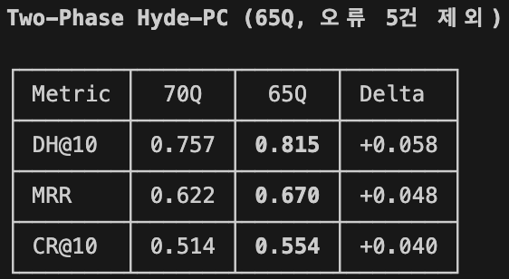
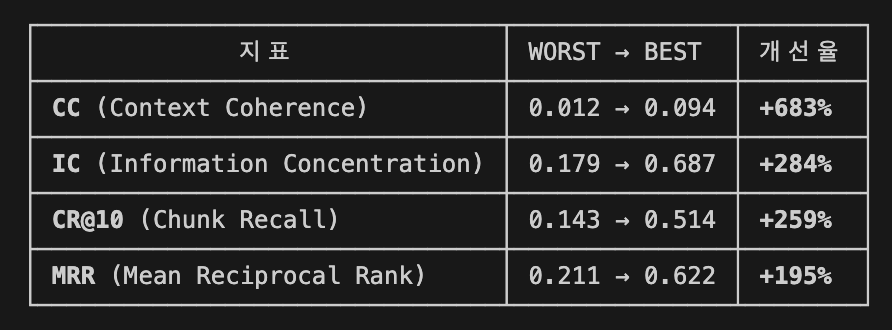
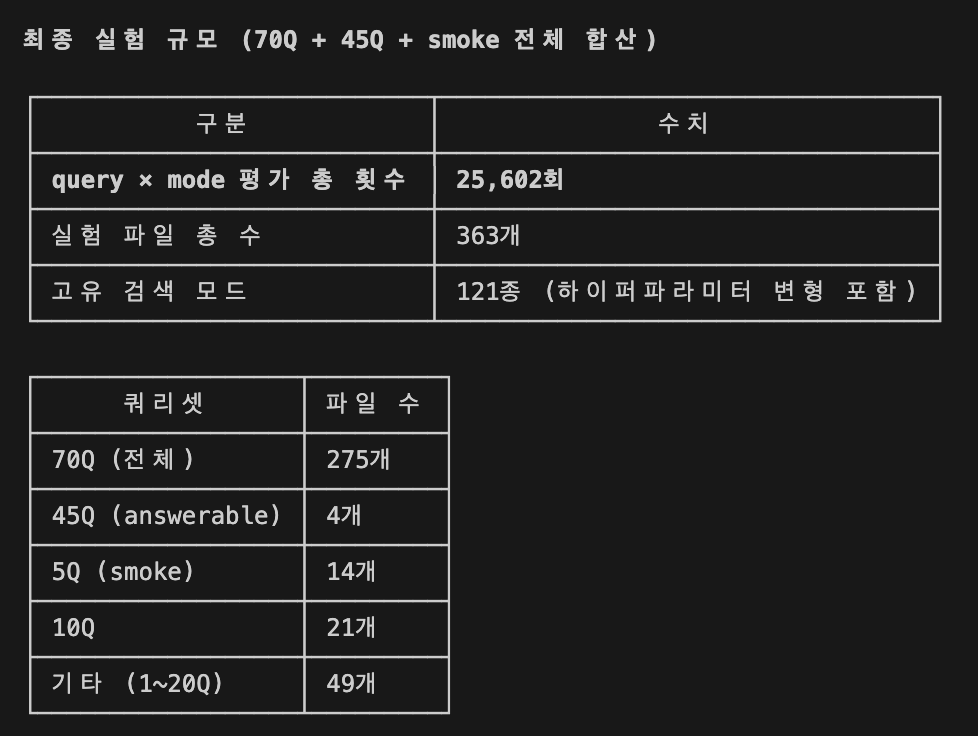
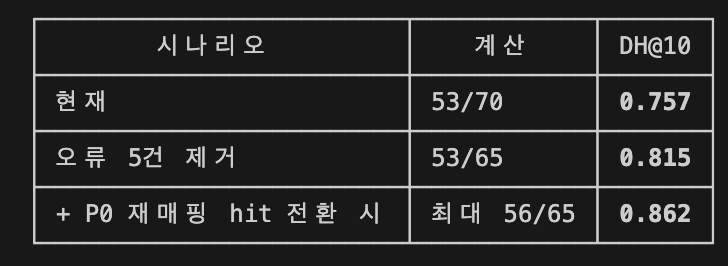
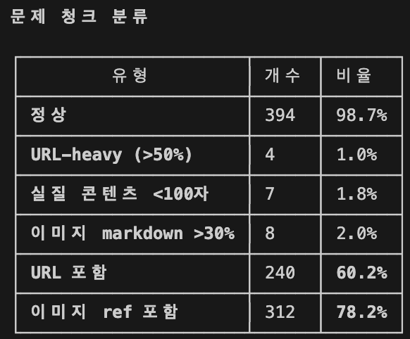
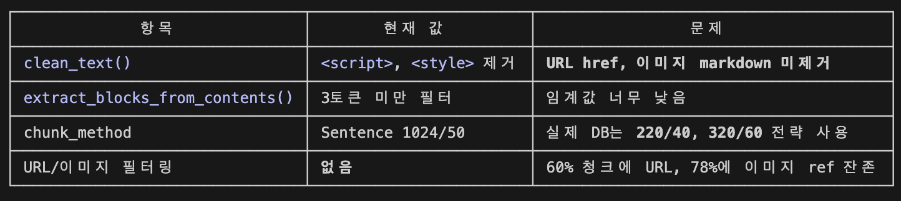
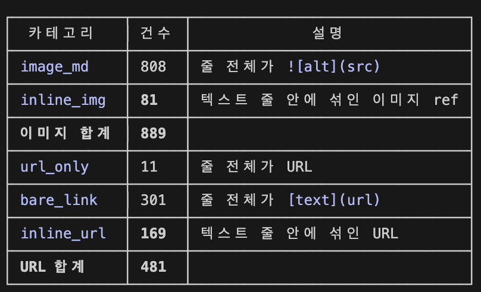
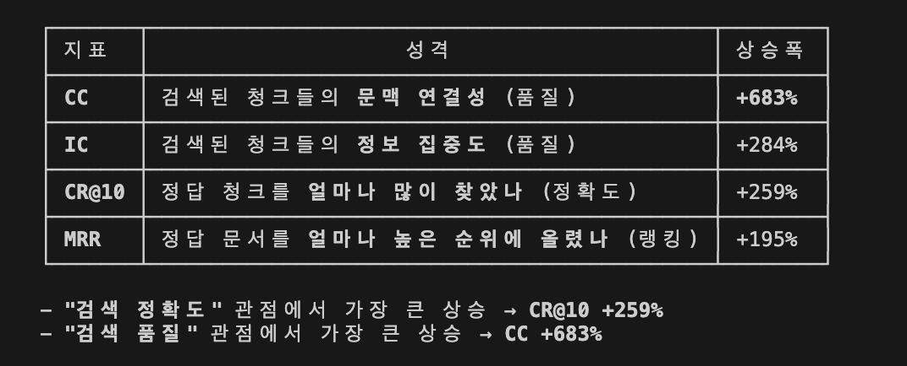
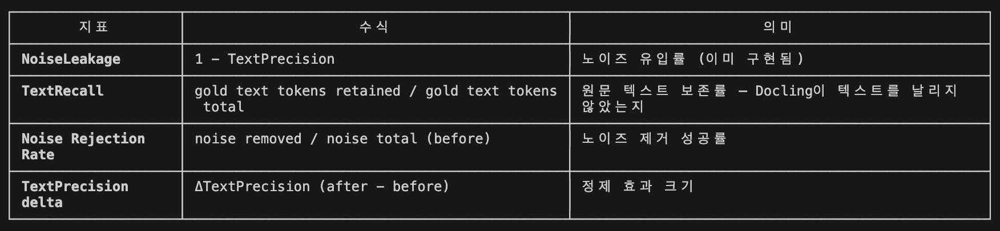

# Review: Phase 2 Caption Four-Mode Corpus Review

## Purpose

Build a human-facing review surface for the current 9-image phase-1 four-mode corpus so a reviewer can inspect the active default, the current comparison winner, and the reason the default still stays active.

## Canonical Inputs

- closure: `../reports/REPORT_phase1_caption_four_mode_corpus_closure-at2026-03-30-22-19.md`
- ready bundle: `../manifests/phase1_caption_four_mode_corpus_ready_bundle_at2026_03_29.json`
- corpus auto-eval: `../manifests/phase1_caption_four_mode_corpus_auto_eval_true_batch_at2026_03_30.json`
- promotion policy: `../specs/prose/SPEC_caption_arm_promotion_policy.md`

## Summary

- generated_at: 2026-03-30 22:47 KST
- corpus image count: 9
- active default: `full_image_baseline`
- corpus winner frequency: `reviewed_isolated_component_rerun = 8`, `full_image_ocr_context_rerun = 1`
- baseline retained across corpus: `yes`
- highest-priority human review set: `image11, image7, image8`
- high-priority human review set: `image10, image12, image13, image14, image9`

## Human Review Priority Index

| image_id | priority | comparison_winner | winner_promotion_state | reasons |
| --- | --- | --- | --- | --- |
| `image11` | `highest` | `reviewed_isolated_component_rerun` | `comparison_ready_reviewed_branch` | winner_differs_from_default, pending_context_review_arm_present, proxy_tie_recommendation, reviewed_branch_ready_for_human_promotion_check |
| `image7` | `highest` | `full_image_ocr_context_rerun` | `comparison_only_pending_context_review` | winner_differs_from_default, pending_context_review_arm_present, proxy_tie_recommendation, winner_is_full_image_ocr_context_rerun |
| `image8` | `highest` | `reviewed_isolated_component_rerun` | `comparison_ready_reviewed_branch` | winner_differs_from_default, pending_context_review_arm_present, proxy_tie_recommendation, reviewed_branch_ready_for_human_promotion_check |
| `image10` | `high` | `reviewed_isolated_component_rerun` | `comparison_only_pending_context_review` | winner_differs_from_default, pending_context_review_arm_present, proxy_tie_recommendation |
| `image12` | `high` | `reviewed_isolated_component_rerun` | `comparison_only_pending_context_review` | winner_differs_from_default, pending_context_review_arm_present, proxy_tie_recommendation |
| `image13` | `high` | `reviewed_isolated_component_rerun` | `comparison_only_pending_context_review` | winner_differs_from_default, pending_context_review_arm_present, proxy_tie_recommendation |
| `image14` | `high` | `reviewed_isolated_component_rerun` | `comparison_only_pending_context_review` | winner_differs_from_default, pending_context_review_arm_present, proxy_tie_recommendation |
| `image9` | `high` | `reviewed_isolated_component_rerun` | `comparison_only_pending_context_review` | winner_differs_from_default, pending_context_review_arm_present, proxy_tie_recommendation |
| `image15` | `elevated` | `reviewed_isolated_component_rerun` | `comparison_only_pending_context_review` | winner_differs_from_default, pending_context_review_arm_present |

## image11

### Surface Summary

- current default: `full_image_baseline`
- comparison winner: `reviewed_isolated_component_rerun`
- winner promotion state: `comparison_ready_reviewed_branch`
- baseline retained: `yes`
- winner reason: highest proxy total with strongest comparative takeaway and noise suppression while keeping core metric coverage
- why default stays default: The active default stays `full_image_baseline` because a `comparison_ready_reviewed_branch` may win bounded comparison without becoming the default; a later explicit promotion decision is still required.
- pending-context-review arms: `full_image_ocr_context_rerun, parser_table_enriched_rerun`
- bundle path: `../manifests/phase0_caption_four_mode_eval_bundle_at2026_03_28.json`
- edge-case review note: top proxy scores are close; use GPT direct image verification for this image if a stronger semantic tie-break is needed
- human-review reasons: `winner_differs_from_default, pending_context_review_arm_present, proxy_tie_recommendation, reviewed_branch_ready_for_human_promotion_check`

### Default vs Winner

**Default Arm: `full_image_baseline`**

> A table compares metrics between 70Q and 65Q with corresponding delta values, under the heading 'Two-Phase Hyde-PC (65Q, 오류 5건 제외)'. The table presents values for DH@10, MRR, and CR@10.

- alt_text: `Table comparing 70Q and 65Q metrics with deltas, titled 'Two-Phase Hyde-PC'.`

**Winner Arm: `reviewed_isolated_component_rerun`**

> A table compares three metrics (DH@10, MRR, CR@10) across two columns (70Q and 65Q) and shows the differences (Delta). The 65Q column has higher values for all metrics.

- alt_text: `Table of DH@10, MRR, and CR@10 for 70Q and 65Q with corresponding Delta values.`

### Promotion States

| arm | promotion_state | next_gate |
| --- | --- | --- |
| `full_image_ocr_context_rerun` | `comparison_only_pending_context_review` | `review_context_package` |
| `parser_table_enriched_rerun` | `comparison_only_pending_context_review` | `review_context_package` |
| `reviewed_isolated_component_rerun` | `comparison_ready_reviewed_branch` | `review_context_package` |

### Why Default Stays Default

- The active default stays `full_image_baseline` because a `comparison_ready_reviewed_branch` may win bounded comparison without becoming the default; a later explicit promotion decision is still required.
- The rerun passed a reviewed-branch gate and may participate in bounded comparison as a non-default arm.
- Keep the baseline active until this reviewed branch is explicitly promoted beyond comparison scope.

## image7

### Surface Summary

- current default: `full_image_baseline`
- comparison winner: `full_image_ocr_context_rerun`
- winner promotion state: `comparison_only_pending_context_review`
- baseline retained: `yes`
- winner reason: highest proxy total with strongest comparative takeaway and noise suppression while keeping core metric coverage
- why default stays default: The active default stays `full_image_baseline` because the comparison winner is still `comparison_only_pending_context_review`, and the promotion policy forbids default replacement while context review remains pending.
- pending-context-review arms: `full_image_ocr_context_rerun, parser_table_enriched_rerun, reviewed_isolated_component_rerun`
- bundle path: `../manifests/phase1_image7_caption_four_mode_eval_bundle_at2026_03_28.json`
- edge-case review note: top proxy scores are close; use GPT direct image verification for this image if a stronger semantic tie-break is needed
- human-review reasons: `winner_differs_from_default, pending_context_review_arm_present, proxy_tie_recommendation, winner_is_full_image_ocr_context_rerun`

### Default vs Winner

**Default Arm: `full_image_baseline`**

> A table displays four performance metrics, their improvements from worst to best values, and the percentage improvement rates. The metrics include Context Coherence, Information Concentration, Chunk Recall, and Mean Reciprocal Rank.

- alt_text: `Table showing four metrics with values for worst to best and percentage improvement.`

**Winner Arm: `full_image_ocr_context_rerun`**

> A table compares four evaluation metrics with their lowest and highest values and percentage improvements. The metrics are CC, IC, CR@10, and MRR.

- alt_text: `A table shows metrics CC, IC, CR@10, and MRR with WORST to BEST values and percent improvements.`

### Promotion States

| arm | promotion_state | next_gate |
| --- | --- | --- |
| `full_image_ocr_context_rerun` | `comparison_only_pending_context_review` | `review_context_package` |
| `parser_table_enriched_rerun` | `comparison_only_pending_context_review` | `review_context_package` |
| `reviewed_isolated_component_rerun` | `comparison_only_pending_context_review` | `review_context_package` |

### Why Default Stays Default

- The active default stays `full_image_baseline` because the comparison winner is still `comparison_only_pending_context_review`, and the promotion policy forbids default replacement while context review remains pending.
- Compare the rerun only as bounded evidence until the context package moves beyond pending_review.
- Keep the full-image baseline as the default until the rerun path is explicitly accepted.

## image8

### Surface Summary

- current default: `full_image_baseline`
- comparison winner: `reviewed_isolated_component_rerun`
- winner promotion state: `comparison_ready_reviewed_branch`
- baseline retained: `yes`
- winner reason: highest proxy total with strongest comparative takeaway and noise suppression while keeping core metric coverage
- why default stays default: The active default stays `full_image_baseline` because a `comparison_ready_reviewed_branch` may win bounded comparison without becoming the default; a later explicit promotion decision is still required.
- pending-context-review arms: `full_image_ocr_context_rerun, parser_table_enriched_rerun`
- bundle path: `../manifests/phase1_image8_caption_four_mode_eval_bundle_at2026_03_28.json`
- edge-case review note: top proxy scores are close; use GPT direct image verification for this image if a stronger semantic tie-break is needed
- human-review reasons: `winner_differs_from_default, pending_context_review_arm_present, proxy_tie_recommendation, reviewed_branch_ready_for_human_promotion_check`

### Default vs Winner

**Default Arm: `full_image_baseline`**

> This image shows two tables summarizing experimental scale information in Korean, including query and mode evaluation counts, total files, and breakdown by query set.

- alt_text: `Two tables in Korean summarize experimental scale and file count by query set.`

**Winner Arm: `reviewed_isolated_component_rerun`**

> A table displays three rows of metrics in Korean, listing counts of evaluations, experiment files, and search modes used in an analysis.

- alt_text: `Table with Korean labels and numeric metrics for evaluation counts, experiment files, and search modes.`

### Promotion States

| arm | promotion_state | next_gate |
| --- | --- | --- |
| `full_image_ocr_context_rerun` | `comparison_only_pending_context_review` | `review_context_package` |
| `parser_table_enriched_rerun` | `comparison_only_pending_context_review` | `review_context_package` |
| `reviewed_isolated_component_rerun` | `comparison_ready_reviewed_branch` | `review_context_package` |

### Why Default Stays Default

- The active default stays `full_image_baseline` because a `comparison_ready_reviewed_branch` may win bounded comparison without becoming the default; a later explicit promotion decision is still required.
- The rerun passed a reviewed-branch gate and may participate in bounded comparison as a non-default arm.
- Keep the baseline active until this reviewed branch is explicitly promoted beyond comparison scope.

## image10

### Surface Summary

- current default: `full_image_baseline`
- comparison winner: `reviewed_isolated_component_rerun`
- winner promotion state: `comparison_only_pending_context_review`
- baseline retained: `yes`
- winner reason: highest proxy total with strongest comparative takeaway and noise suppression while keeping core metric coverage
- why default stays default: The active default stays `full_image_baseline` because the comparison winner is still `comparison_only_pending_context_review`, and the promotion policy forbids default replacement while context review remains pending.
- pending-context-review arms: `full_image_ocr_context_rerun, parser_table_enriched_rerun, reviewed_isolated_component_rerun`
- bundle path: `../manifests/phase1_image10_caption_four_mode_eval_bundle_at2026_03_28.json`
- edge-case review note: top proxy scores are close; use GPT direct image verification for this image if a stronger semantic tie-break is needed
- human-review reasons: `winner_differs_from_default, pending_context_review_arm_present, proxy_tie_recommendation`

### Default vs Winner

**Default Arm: `full_image_baseline`**

> A table in Korean showing three scenarios with calculations and corresponding DH@10 values. Each row lists a scenario, a calculation, and a bolded decimal value.

- alt_text: `Korean table showing three scenarios with calculations and DH@10 values.`

**Winner Arm: `reviewed_isolated_component_rerun`**

> A table in Korean presents three scenarios with corresponding calculations and DH@10 values, showing incremental improvements.

- alt_text: `Korean table comparing scenarios and DH@10 values, including calculations like 53/70 and 0.757.`

### Promotion States

| arm | promotion_state | next_gate |
| --- | --- | --- |
| `full_image_ocr_context_rerun` | `comparison_only_pending_context_review` | `review_context_package` |
| `parser_table_enriched_rerun` | `comparison_only_pending_context_review` | `review_context_package` |
| `reviewed_isolated_component_rerun` | `comparison_only_pending_context_review` | `review_context_package` |

### Why Default Stays Default

- The active default stays `full_image_baseline` because the comparison winner is still `comparison_only_pending_context_review`, and the promotion policy forbids default replacement while context review remains pending.
- Compare the rerun only as bounded evidence until the context package moves beyond pending_review.
- Keep the full-image baseline as the default until the rerun path is explicitly accepted.

## image12

### Surface Summary

- current default: `full_image_baseline`
- comparison winner: `reviewed_isolated_component_rerun`
- winner promotion state: `comparison_only_pending_context_review`
- baseline retained: `yes`
- winner reason: highest proxy total with strongest comparative takeaway and noise suppression while keeping core metric coverage
- why default stays default: The active default stays `full_image_baseline` because the comparison winner is still `comparison_only_pending_context_review`, and the promotion policy forbids default replacement while context review remains pending.
- pending-context-review arms: `full_image_ocr_context_rerun, parser_table_enriched_rerun, reviewed_isolated_component_rerun`
- bundle path: `../manifests/phase1_image12_caption_four_mode_eval_bundle_at2026_03_30.json`
- edge-case review note: top proxy scores are close; use GPT direct image verification for this image if a stronger semantic tie-break is needed
- human-review reasons: `winner_differs_from_default, pending_context_review_arm_present, proxy_tie_recommendation`

### Default vs Winner

**Default Arm: `full_image_baseline`**

> A table in Korean categorizes problem check types with columns for type, count, and percentage. Various content issues such as URL-heavy and image markdown are listed.

- alt_text: `A classification table in Korean showing problem check types, counts, and percentages.`

**Winner Arm: `reviewed_isolated_component_rerun`**

> A table presents statistics on different categories of issues, showing counts and percentages for each type. The categories include 'normal', 'URL-heavy', 'short content', 'image markdown', 'URL included', and 'image reference included'.

- alt_text: `Table showing issue type classifications with counts and percentages in Korean.`

### Promotion States

| arm | promotion_state | next_gate |
| --- | --- | --- |
| `full_image_ocr_context_rerun` | `comparison_only_pending_context_review` | `review_context_package` |
| `parser_table_enriched_rerun` | `comparison_only_pending_context_review` | `review_context_package` |
| `reviewed_isolated_component_rerun` | `comparison_only_pending_context_review` | `review_context_package` |

### Why Default Stays Default

- The active default stays `full_image_baseline` because the comparison winner is still `comparison_only_pending_context_review`, and the promotion policy forbids default replacement while context review remains pending.
- Compare the rerun only as bounded evidence until the context package moves beyond pending_review.
- Keep the full-image baseline as the default until the rerun path is explicitly accepted.

## image13

### Surface Summary

- current default: `full_image_baseline`
- comparison winner: `reviewed_isolated_component_rerun`
- winner promotion state: `comparison_only_pending_context_review`
- baseline retained: `yes`
- winner reason: highest proxy total with strongest comparative takeaway and noise suppression while keeping core metric coverage
- why default stays default: The active default stays `full_image_baseline` because the comparison winner is still `comparison_only_pending_context_review`, and the promotion policy forbids default replacement while context review remains pending.
- pending-context-review arms: `full_image_ocr_context_rerun, parser_table_enriched_rerun, reviewed_isolated_component_rerun`
- bundle path: `../manifests/phase1_image13_caption_four_mode_eval_bundle_at2026_03_30.json`
- edge-case review note: top proxy scores are close; use GPT direct image verification for this image if a stronger semantic tie-break is needed
- human-review reasons: `winner_differs_from_default, pending_context_review_arm_present, proxy_tie_recommendation`

### Default vs Winner

**Default Arm: `full_image_baseline`**

> A table compares various methods and their issues related to text extraction and filtering in Korean and English. It lists method names, current settings, and associated problems.

- alt_text: `A table with Korean and English text extraction methods and corresponding issues.`

**Winner Arm: `reviewed_isolated_component_rerun`**

> A table appears with three columns labeled 항목 (Item), 현재 값 (Current Value), and 문제 (Issue), displaying settings and issues for text processing functions.

- alt_text: `Table shows items, current values, and issues for several text processing methods.`

### Promotion States

| arm | promotion_state | next_gate |
| --- | --- | --- |
| `full_image_ocr_context_rerun` | `comparison_only_pending_context_review` | `review_context_package` |
| `parser_table_enriched_rerun` | `comparison_only_pending_context_review` | `review_context_package` |
| `reviewed_isolated_component_rerun` | `comparison_only_pending_context_review` | `review_context_package` |

### Why Default Stays Default

- The active default stays `full_image_baseline` because the comparison winner is still `comparison_only_pending_context_review`, and the promotion policy forbids default replacement while context review remains pending.
- Compare the rerun only as bounded evidence until the context package moves beyond pending_review.
- Keep the full-image baseline as the default until the rerun path is explicitly accepted.

## image14

### Surface Summary

- current default: `full_image_baseline`
- comparison winner: `reviewed_isolated_component_rerun`
- winner promotion state: `comparison_only_pending_context_review`
- baseline retained: `yes`
- winner reason: highest proxy total with strongest comparative takeaway and noise suppression while keeping core metric coverage
- why default stays default: The active default stays `full_image_baseline` because the comparison winner is still `comparison_only_pending_context_review`, and the promotion policy forbids default replacement while context review remains pending.
- pending-context-review arms: `full_image_ocr_context_rerun, parser_table_enriched_rerun, reviewed_isolated_component_rerun`
- bundle path: `../manifests/phase1_image14_caption_four_mode_eval_bundle_at2026_03_30.json`
- edge-case review note: top proxy scores are close; use GPT direct image verification for this image if a stronger semantic tie-break is needed
- human-review reasons: `winner_differs_from_default, pending_context_review_arm_present, proxy_tie_recommendation`

### Default vs Winner

**Default Arm: `full_image_baseline`**

> A table with three columns details categories, counts, and descriptions related to images and URLs. Categories are listed in both English and Korean.

- alt_text: `Table categorizing counts and descriptions of images and URLs with headers in Korean.`

**Winner Arm: `reviewed_isolated_component_rerun`**

> A table in Korean compares counts and descriptions for image and URL categories. Table columns include 카테고리 (category), 건수 (count), and 설명 (description).

- alt_text: `Table in Korean showing counts and descriptions for image and URL-related categories.`

### Promotion States

| arm | promotion_state | next_gate |
| --- | --- | --- |
| `full_image_ocr_context_rerun` | `comparison_only_pending_context_review` | `review_context_package` |
| `parser_table_enriched_rerun` | `comparison_only_pending_context_review` | `review_context_package` |
| `reviewed_isolated_component_rerun` | `comparison_only_pending_context_review` | `review_context_package` |

### Why Default Stays Default

- The active default stays `full_image_baseline` because the comparison winner is still `comparison_only_pending_context_review`, and the promotion policy forbids default replacement while context review remains pending.
- Compare the rerun only as bounded evidence until the context package moves beyond pending_review.
- Keep the full-image baseline as the default until the rerun path is explicitly accepted.

## image9

### Surface Summary

- current default: `full_image_baseline`
- comparison winner: `reviewed_isolated_component_rerun`
- winner promotion state: `comparison_only_pending_context_review`
- baseline retained: `yes`
- winner reason: highest proxy total with strongest comparative takeaway and noise suppression while keeping core metric coverage
- why default stays default: The active default stays `full_image_baseline` because the comparison winner is still `comparison_only_pending_context_review`, and the promotion policy forbids default replacement while context review remains pending.
- pending-context-review arms: `full_image_ocr_context_rerun, parser_table_enriched_rerun, reviewed_isolated_component_rerun`
- bundle path: `../manifests/phase1_image9_caption_four_mode_eval_bundle_at2026_03_28.json`
- edge-case review note: top proxy scores are close; use GPT direct image verification for this image if a stronger semantic tie-break is needed
- human-review reasons: `winner_differs_from_default, pending_context_review_arm_present, proxy_tie_recommendation`

### Default vs Winner

**Default Arm: `full_image_baseline`**

> A table in Korean compares four metrics (CC, IC, CR@10, MRR) for quality and accuracy improvements, showing percentage increases for each. Key improvements are highlighted below the table.

- alt_text: `A Korean table comparing search metrics (CC, IC, CR@10, MRR) and their improvement percentages.`

**Winner Arm: `reviewed_isolated_component_rerun`**

> A table in Korean compares four performance indicators (CC, IC, CR@10, MRR) with their descriptions and respective percentage improvements. The table is structured into three columns: indicator, description, and relative increase.

- alt_text: `Table showing Korean performance metrics CC, IC, CR@10, MRR each with description and percentage increase.`

### Promotion States

| arm | promotion_state | next_gate |
| --- | --- | --- |
| `full_image_ocr_context_rerun` | `comparison_only_pending_context_review` | `review_context_package` |
| `parser_table_enriched_rerun` | `comparison_only_pending_context_review` | `review_context_package` |
| `reviewed_isolated_component_rerun` | `comparison_only_pending_context_review` | `review_context_package` |

### Why Default Stays Default

- The active default stays `full_image_baseline` because the comparison winner is still `comparison_only_pending_context_review`, and the promotion policy forbids default replacement while context review remains pending.
- Compare the rerun only as bounded evidence until the context package moves beyond pending_review.
- Keep the full-image baseline as the default until the rerun path is explicitly accepted.

## image15

### Surface Summary

- current default: `full_image_baseline`
- comparison winner: `reviewed_isolated_component_rerun`
- winner promotion state: `comparison_only_pending_context_review`
- baseline retained: `yes`
- winner reason: highest proxy total with strongest comparative takeaway and noise suppression while keeping core metric coverage
- why default stays default: The active default stays `full_image_baseline` because the comparison winner is still `comparison_only_pending_context_review`, and the promotion policy forbids default replacement while context review remains pending.
- pending-context-review arms: `full_image_ocr_context_rerun, parser_table_enriched_rerun, reviewed_isolated_component_rerun`
- bundle path: `../manifests/phase1_image15_caption_four_mode_eval_bundle_at2026_03_30.json`
- human-review reasons: `winner_differs_from_default, pending_context_review_arm_present`

### Default vs Winner

**Default Arm: `full_image_baseline`**

> This image shows a table with three columns and four rows, displaying metrics related to text and noise processing. The table headers and explanations are written in both Korean and English.

- alt_text: `Table showing text and noise processing metrics with descriptions in Korean and English.`

**Winner Arm: `reviewed_isolated_component_rerun`**

> A table lists four metrics (NoiseLeakage, TextRecall, Noise Rejection Rate, TextPrecision delta) with formulas and Korean-language explanations.

- alt_text: `Table showing four metrics with English formulas and Korean explanations.`

### Promotion States

| arm | promotion_state | next_gate |
| --- | --- | --- |
| `full_image_ocr_context_rerun` | `comparison_only_pending_context_review` | `review_context_package` |
| `parser_table_enriched_rerun` | `comparison_only_pending_context_review` | `review_context_package` |
| `reviewed_isolated_component_rerun` | `comparison_only_pending_context_review` | `review_context_package` |

### Why Default Stays Default

- The active default stays `full_image_baseline` because the comparison winner is still `comparison_only_pending_context_review`, and the promotion policy forbids default replacement while context review remains pending.
- Compare the rerun only as bounded evidence until the context package moves beyond pending_review.
- Keep the full-image baseline as the default until the rerun path is explicitly accepted.
