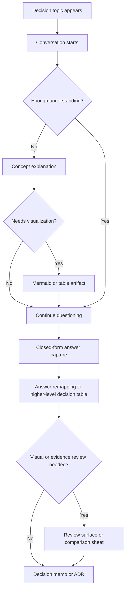

# Decision Support UX/UI Design Note

## Status

Draft

## Purpose

이 문서는 `my-image-parser` workspace의 의사결정 지원 방식을 UX/UI 관점에서 정리한다.

핵심 전제는 다음과 같다.

- 질문지는 별도 앱보다 대화형 흐름이 더 적합하다.
- 그래프 시각화와 이미지 캡션 대조 검토는 `Obsidian`, `VSCode Markdown Preview`, `Mermaid` 같은 Markdown 기반 도구로 충분히 대체 가능하다.
- `Claude Artifact` 계열은 스크립트나 렌더 결과를 즉시 보여주는 UX에 강하다.
- `Obsidian` 계열은 경로, 파일, 링크, embed를 중심으로 자산을 탐색하고 편집하는 UX에 강하다.
- 따라서 목표는 새로운 GUI 제품을 만드는 것이 아니라, `대화 + Markdown artifact + 시각화 + 비교 리뷰`를 하나의 decision-support UX로 설계하는 것이다.

Related artifacts:

- [REFERENCE_decision_support_prompt.md](/Users/jaehyuntak/Desktop/Project_____현재_진행중인/my-image-parser/control/user_decisions/resources/closed_questions/REFERENCE_decision_support_prompt.md)
- [VISUAL_master_plan_presentation_image_pipeline-at2026-03-28-10-13.md](/Users/jaehyuntak/Desktop/Project_____현재_진행중인/my-image-parser/control/user_decisions/resources/notes/VISUAL_master_plan_presentation_image_pipeline-at2026-03-28-10-13.md)
- [NOTE_vscode_first_surface_model-at2026-03-29-01-04.md](/Users/jaehyuntak/Desktop/Project_____현재_진행중인/my-image-parser/control/user_decisions/resources/notes/NOTE_vscode_first_surface_model-at2026-03-29-01-04.md)

## Design Position

이 의사결정 지원 체계는 세 가지 surface의 조합으로 본다.

1. `Conversation Surface`
   - 질문 생성
   - 개념 설명
   - 선택 강요
   - 답변 재매핑
2. `Visualization Surface`
   - 질문 의존관계 설명
   - 상위 전략과 하위 결정을 트리나 흐름도로 표현
   - 복잡한 개념을 한눈에 압축
3. `Review Surface`
   - 이미지 캡션 대조 검토
   - evidence side-by-side 비교
   - 최종 선택과 사유 기록

즉, "질문지", "그래프 시각화", "이미지 캡션 대조 검토"는 분리된 도구라기보다 하나의 의사결정 여정 안에서 서로 다른 화면 역할을 맡는다.

## Rendering Model Distinction

의사결정 지원 UX에서 중요한 차이는 단순히 "에디터가 무엇인가"가 아니라 "무엇을 기준으로 렌더링하는가"이다.

### Claude Artifact Style

핵심 기준은 `script-based render`다.

- 스크립트나 계산 결과를 바로 시각적 산출물로 보여준다.
- graph, chart, lightweight dashboard, scripted interaction에 강하다.
- "무엇을 실행해서 어떤 화면을 그릴 것인가"가 중심이다.

즉, Claude Artifact 스타일은 `rendered output first`에 가깝다.

### Obsidian Style

핵심 기준은 `path-based organization`이다.

- 파일 경로, 링크, embed, backlink, note graph가 중심이다.
- 이미지 파일명 변경, 이미지 호출, live preview, linked note navigation에 강하다.
- "어떤 파일이 어디 있고 무엇과 연결되는가"가 중심이다.

즉, Obsidian 스타일은 `file and path first`에 가깝다.

## UX Consequence For This Workspace

현재 workspace에서는 두 렌더링 모델을 구분해서 써야 한다.

### Obsidian-like responsibilities

다음은 path-based UX가 맡는 것이 맞다.

- 이미지 시각화
- 이미지 embed와 live view
- 이미지 파일명 검토와 수정
- 문서 간 링크와 backlink
- 결정 기록 보존

### Claude-Artifact-like responsibilities

다음은 script-rendered UX 감각을 차용하는 것이 맞다.

- Mermaid나 비교 그래프의 즉시 렌더
- 간단한 decision map
- 후보 비교판
- parser/OCR/caption 결과를 묶어 보여주는 lightweight review panel

### Recommended hybrid

따라서 권장 구조는 다음이다.

- 기반 운영 모델은 `Obsidian-like path-based workspace`
- 시각화와 비교 패널의 UX 감각은 `Claude-Artifact-like scripted render`

한 줄로 말하면:

`이미지는 Obsidian이 잘 보여주고, 스크립트 결과는 Artifact 방식이 잘 보여준다.`

## Primary UX Principle

### 1. Conversation First

결정은 대화에서 시작한다.

별도 폼 입력보다 대화형 질문이 더 적합한 이유:

- 사용자가 이해가 부족한 지점을 즉시 드러낼 수 있다.
- 질문을 순차적으로 재구성할 수 있다.
- 상위 철학 선택으로 하위 질문 수를 줄일 수 있다.

### 2. Visualization On Demand

시각화는 기본 화면이 아니라, 이해가 막히는 순간 호출되는 보조 설명 수단이다.

트리거 예시:

- 질문들이 서로 의존할 때
- 개념 설명이 길어질 때
- 이미 답한 내용을 다시 구조화해야 할 때
- trade-off를 한 화면에 보여줘야 할 때

### 3. Review Before Commitment

특히 이미지/캡션 관련 의사결정은 최종 commit 전에 비교 검토 surface가 필요하다.

핵심은:

- 후보를 나란히 보기
- 증거를 함께 보기
- 선택 이유를 기록하기

### 4. Markdown Native Over Custom App

현재 단계에서는 전용 앱보다 Markdown 기반 artifact가 더 적합하다.

이유:

- 이미 `Obsidian`과 `VSCode`가 있다.
- 파일이 곧 기록이고 버전 관리 대상이다.
- AI와 사람이 같은 artifact를 공유하기 쉽다.
- 구조 변경 비용이 낮다.

단, 이 원칙은 "render UX까지 모두 Obsidian처럼 하자"는 뜻은 아니다.

적절한 해석은 다음과 같다.

- 기록과 경로 관리의 source of truth는 Markdown과 path 구조가 맡는다.
- 계산 결과, 비교판, 그래프의 즉시 시각화 UX는 Artifact-like render 감각을 차용한다.

## User Journey

## UX Modules

### Module A. Decision Conversation

가장 기본적인 진입점.

구성 요소:

- 문제 한 줄 요약
- 현재 결정해야 할 질문 수
- 상위 철학 선택 질문
- 핵심 개념 이해 확인 질문
- 남은 질문 축소 여부

필수 UX 요구:

- 질문은 폐쇄형으로 좁혀져야 한다.
- 질문 간 의존관계가 있으면 숨기지 말고 드러내야 한다.
- 사용자가 "이해가 어렵다"고 말하면 바로 설명 모드로 전환해야 한다.

### Module B. Concept Bridge

이해가 부족한 개념을 설명하는 모듈.

구성 요소:

- 한 줄 정의
- 비유
- 최소 예시
- 왜 이 결정에서 중요한지
- 헷갈리기 쉬운 경계

필수 UX 요구:

- 설명은 결정과 연결되어야 한다.
- 백과사전식 설명보다 "왜 이걸 알아야 지금 답할 수 있는지"가 먼저 나와야 한다.

### Module C. Visualization Aid

질문 사이 관계나 상위 구조를 시각적으로 보여주는 모듈.

권장 형식:

- `Mermaid flowchart`
- `Mermaid stateDiagram`
- Markdown table
- 선택지 비교표

필수 UX 요구:

- 시각화는 단순해야 한다.
- 하나의 다이어그램은 하나의 혼란만 줄여야 한다.
- 설명을 대신하는 것이 아니라 설명을 압축하는 역할이어야 한다.
- 가능한 경우 Markdown 안에서 렌더되되, UX 감각은 scripted artifact처럼 즉시 이해되게 설계한다.

### Module D. Caption Review Surface

이미지 캡션 대조 검토를 위한 비교 화면.

최소 구성:

- 대상 이미지 식별자
- 후보 캡션 A/B/C/D
- parser 또는 OCR evidence
- 장점
- 문제점
- 최종 선택
- 선택 이유

필수 UX 요구:

- side-by-side 비교가 쉬워야 한다.
- evidence가 캡션보다 뒤에 숨지 말아야 한다.
- 선택 이유는 나중에 재검토 가능하도록 짧게 남겨야 한다.
- 원본 이미지와 후보 캡션의 관계는 Obsidian-style embed로 잘 보여주고, 비교판 구성은 Artifact-like review panel 감각으로 설계한다.

## Minimal Information Architecture

현재 workspace에서는 다음 구조가 가장 자연스럽다.

- `control/user_decisions/resources/closed_questions/`
  - 질문 프롬프트
  - 폐쇄형 질문 inbox
- `control/user_decisions/resources/notes/`
  - Mermaid 시각화
  - UX/UI 설계 노트
  - 해설 문서
- `control/user_decisions/resources/reports/`
  - 특정 실험이나 실제 결정 세션 기록
- `control/user_decisions/resources/adr/`
  - 최종 결정 문서

## Recommended Screens Without Building A New App

실제 구현은 새 앱 없이 아래 4개 artifact 패턴으로 충분하다.

1. `Conversation Prompt`
   - 대화 시작용 프롬프트
2. `Decision Map`
   - Mermaid 기반 구조도
3. `Comparison Review Sheet`
   - 캡션/후보/evidence 비교용 Markdown 템플릿
4. `Decision Record`
   - 최종 ADR 또는 closed-question answer

이때 화면 감각은 다음처럼 분리한다.

- `Conversation Prompt`, `Decision Record`: Obsidian-like
- `Decision Map`, `Comparison Review Sheet`: Obsidian 안에서 보되 Artifact-like

## What To Design Next

지금 가장 가치가 큰 UX/UI 설계 후속 작업은 아래 둘이다.

1. `Caption comparison review sheet`
   - 이미지 캡션 대조 검토를 반복 가능한 Markdown 템플릿으로 고정
2. `Decision map skeleton`
   - 질문 의존관계와 상위 철학 선택을 그리는 Mermaid 스켈레톤 제공

질문 프롬프트 자체는 이미 충분히 대화형이므로, 새로 디자인해야 할 것은 질문지가 아니라 `시각화 surface`와 `비교 검토 surface`다.

## One-Line Conclusion

이 의사결정 지원 체계의 UX/UI는 `Obsidian-like path-based workspace`를 기반으로 두고, `Claude-Artifact-like rendered graph and comparison UX`를 보조 레이어로 얹는 방식이 가장 적합하다.
