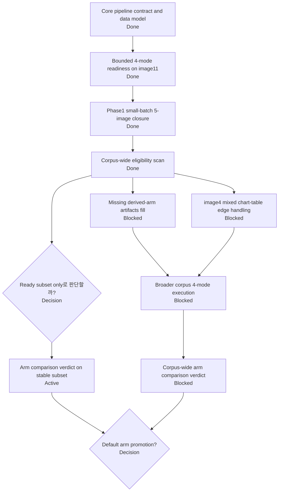
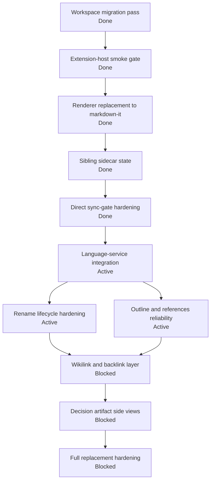
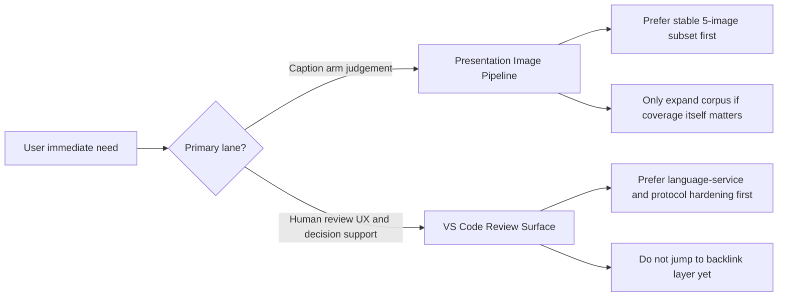

# Reference: Master Plan Task Graphs

## Purpose

복잡한 process에서는 진행률 퍼센트보다:

- 무엇이 무엇에 선행하는지
- 지금 병목이 어디인지
- 어떤 노드를 닫아야 다음 lane이 열리는지

를 보는 것이 더 중요하다.

이 문서는 그 목적에 맞는 Mermaid task graph view다.

## Reading Rule

- `done`: 이미 닫힌 노드
- `active`: 현재 진행 중이거나 바로 다음 작업
- `blocked`: 선행 조건 때문에 막힌 노드
- `decision`: 사용자 판단이 필요한 노드

---

## Graph 1. Presentation Image Pipeline

### Current Reading

- 이미 많이 끝난 부분:
  - contract
  - bounded 4-mode readiness
  - 5-image small-batch closure
  - corpus eligibility scan
- 현재 병목:
  - broader corpus를 원하면 derived-arm artifact 부족
  - `image4` mixed chart-table edge case
- 지금 가장 현실적인 active node:
  - `Arm comparison verdict on stable subset`

---

## Graph 2. VS Code Markdown Review Surface

### Current Reading

- 이미 끝난 core MVP:
  - migration
  - smoke
  - renderer
  - sidecar
  - sync-gate hardening
- 현재 active node:
  - `Language-service integration`
- 현재 병목:
  - rename lifecycle correctness
  - extension-host confidence gap
- 아직 시기상조:
  - backlink/wikilink
  - decision artifact side views
  - full replacement hardening

---

## Graph 3. Cross-Plan Priority Choice

## Practical Rule

복잡할수록 먼저 보는 것은:

1. progress dashboard
   - 지금 active lane이 무엇인지
2. task graph
   - 무엇이 병목인지
3. detailed plan
   - 실제 규칙과 contract가 무엇인지

즉:

- dashboard는 `현재 상태`
- task graph는 `의존성과 병목`
- master plan 본문은 `정확한 계약`

을 담당한다.
