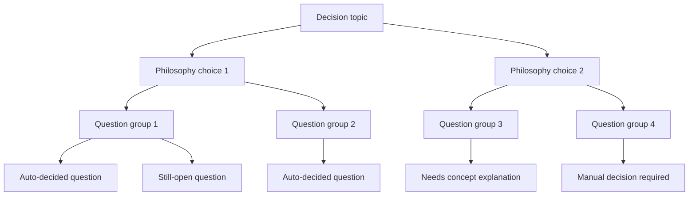
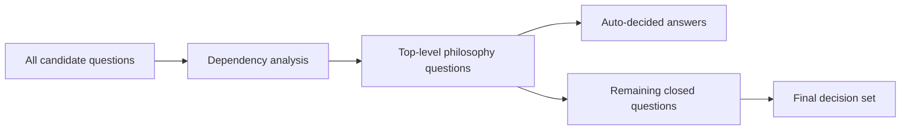
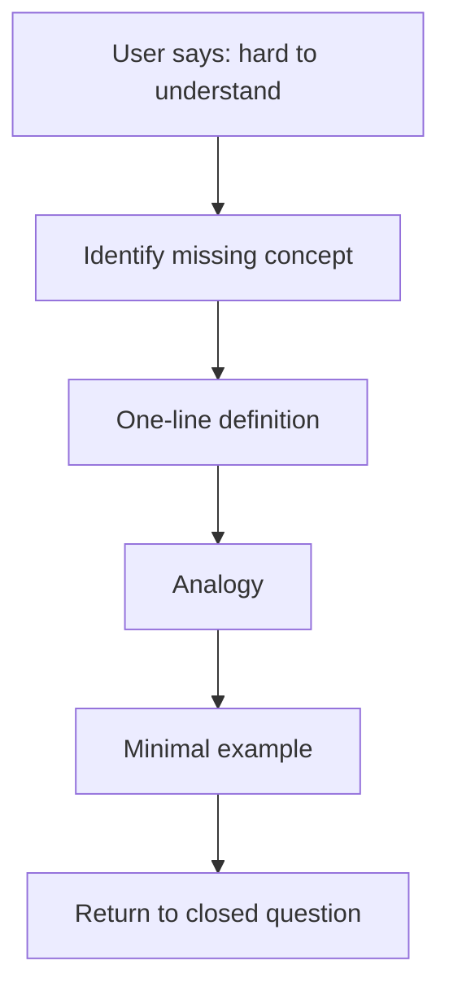

# Decision Map Skeleton

## Purpose

복잡한 의사결정에서 상위 철학, 하위 질문, 남은 미결정을 Mermaid로 압축해서 보여주기 위한 스켈레톤.

## How To Use

- 먼저 상위 철학 선택 1~2개를 적는다.
- 그 선택이 자동으로 결정하는 하위 질문을 연결한다.
- 아직 미결인 항목만 별도로 분리한다.
- 설명이 필요한 개념은 `Concept Bridge` 노드로 빼서 연결한다.

## Skeleton A. Philosophy To Questions



## Skeleton B. Closed Questions Reduction



## Skeleton C. Concept Bridge



## Fill-In Template

### Decision Topic

```md
[what must be decided]
```

### Top-Level Philosophy Choices

- Choice 1:
- Choice 2:

### Auto-Decided Questions

- [question id]:
- [question id]:

### Still Open

- [question id]:
- [question id]:

### Needs Concept Bridge

- [concept]:
- [concept]:
