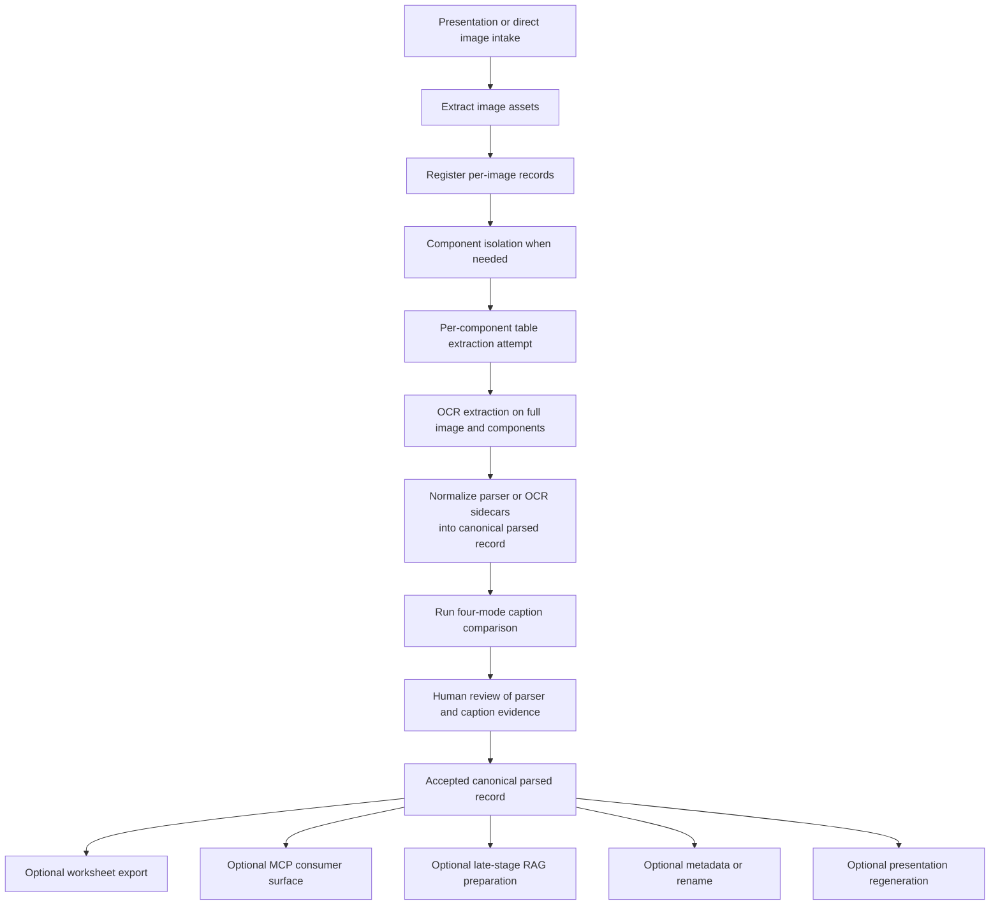
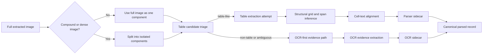
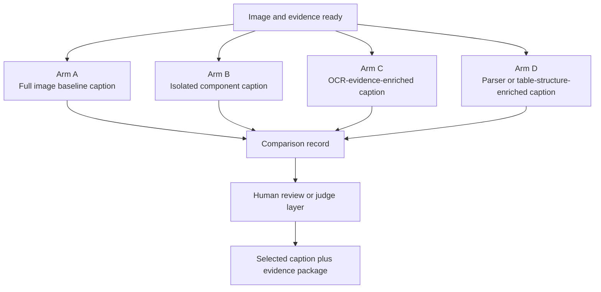
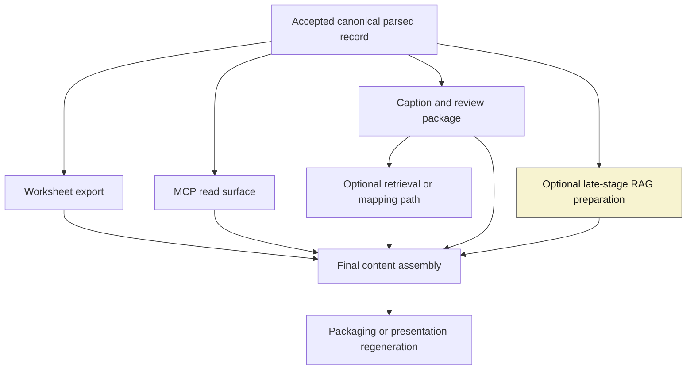
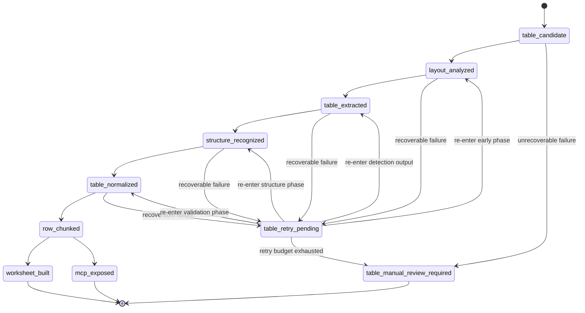

# Visualization Companion: Master Plan Presentation Image Pipeline

## Status

Draft

## Purpose

This companion document translates the canonical master plan into Obsidian-friendly Mermaid diagrams.
It is a visualization aid, not the source of truth.
The diagrams below follow the current parser-first active baseline rather than the older caption-first reading.

Canonical source:

- [MASTER_PLAN_presentation_image_pipeline.md](/Users/jaehyuntak/Desktop/Project_____현재_진행중인/my-image-parser/control/project_domain/resources/master_plans/MASTER_PLAN_presentation_image_pipeline.md)

## VSCode Viewing

- Open this file in VSCode.
- Use `Markdown: Open Preview` or `Ctrl+Shift+V`.
- `Markdown Preview Mermaid Support` should render the Mermaid blocks directly in preview.
- `Live Server` is optional and not required for this markdown-based companion.

## Diagram 1. Active Parser-First Baseline

## Diagram 2. Component Isolation And Parser Evidence Flow

## Diagram 3. Four-Mode Caption Comparison

## Diagram 4. Late-Stage Consumer Ordering

## Diagram 5. Table-Branch State Flow With Retry

## Reading Notes

- Diagram 1 is the active parser-first baseline for the workspace.
- Diagram 2 shows how component isolation and parser or OCR evidence feed canonical records.
- Diagram 3 places the four-mode caption experiment after parser and OCR evidence collection.
- Diagram 4 shows that worksheet, MCP, and caption are immediate late-stage consumers, while RAG is deferred even further.
- Diagram 5 remains the table-branch retry state machine.
